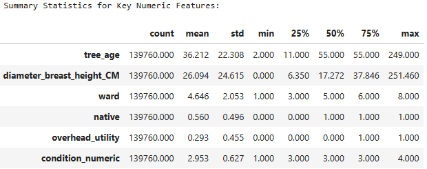
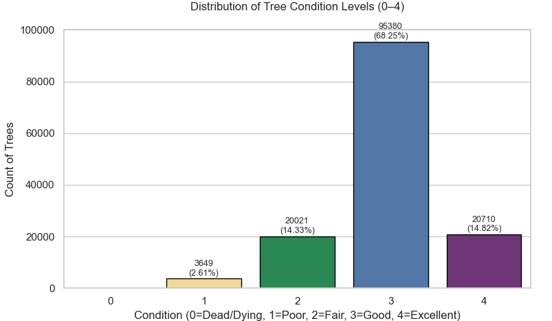
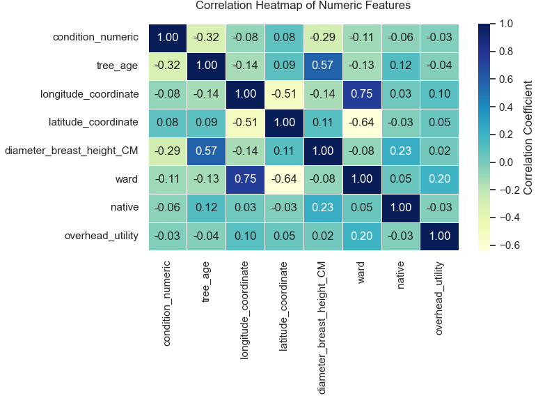
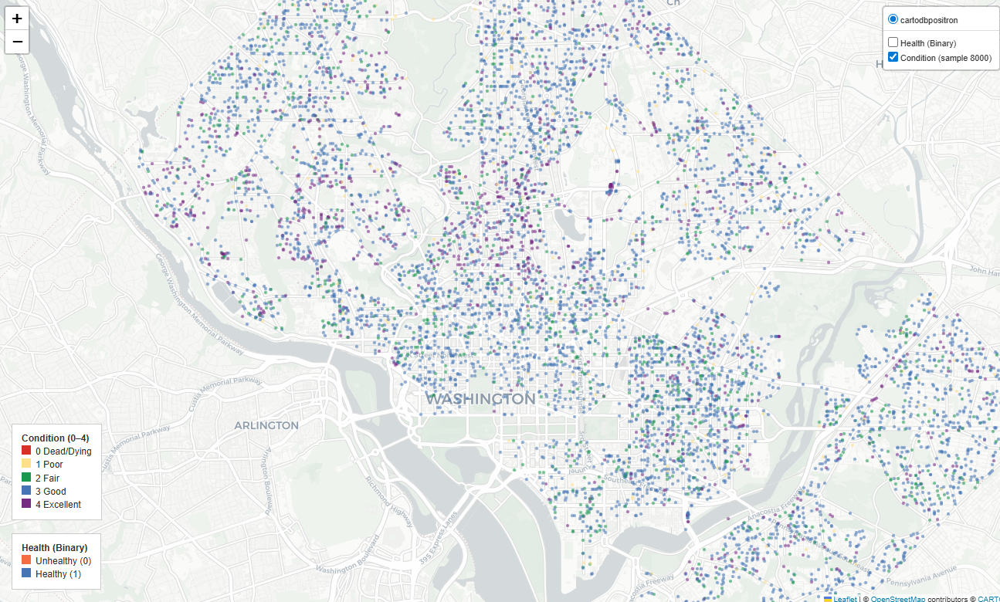

# Predicting and Analyzing Tree Health in Urban Cities

**Author:** Justin D. Schroder
**Affiliation:** Northwest Missouri State University, Maryville MO 64468, USA
**Contact:** S576004@nwmissouri.edu

---

## Abstract

> _Replace this placeholder with your final abstract (150–250 words)._
> Summarize the dataset (5M Trees; Washington, D.C. subset), methods (EDA, geospatial mapping, Random Forest classification), and key findings (e.g., condition distribution, most influential features, practical implications for urban forestry).

**Keywords:** machine learning · forest ecology · environmental data analysis · classification

---

## Table of Contents

- [Predicting and Analyzing Tree Health in Urban Cities](#predicting-and-analyzing-tree-health-in-urban-cities)
  - [Abstract](#abstract)
  - [Table of Contents](#table-of-contents)
  - [Introduction](#introduction)
  - [Project Links](#project-links)
  - [Dataset](#dataset)
    - [Data Extraction and Loading](#data-extraction-and-loading)
    - [Data Dictionary](#data-dictionary)
  - [Methodology](#methodology)
    - [Data Preparation and Feature Engineering](#data-preparation-and-feature-engineering)
  - [Exploratory Data Analysis (EDA)](#exploratory-data-analysis-eda)
  - [Geospatial Analysis](#geospatial-analysis)
  - [Random Forest Classifier](#random-forest-classifier)
  - [Results and Analysis](#results-and-analysis)
    - [EDA Results](#eda-results)
    - [Geospatial Results](#geospatial-results)
  - [Getting Started](#getting-started)
    - [Environment Setup (uv)](#environment-setup-uv)
- [Create virtual environment](#create-virtual-environment)
- [Activate (Windows)](#activate-windows)
- [Or on macOS/Linux](#or-on-macoslinux)
- [Install dependencies defined in pyproject.toml](#install-dependencies-defined-in-pyprojecttoml)

---

## Introduction

Trees are essential for natural environments in both rural and urban locations. They cover about **31%** of the Earth’s land area, with more than half located in just five countries, one of which is the United States of America \[FAO\]. Trees regulate climate, maintain the water cycle, replenish nutrients back into the soil, and support biodiversity.

In cities, trees reduce energy usage, remove air pollutants, filter stormwater, and cool hot streets by providing shade and releasing water vapor. Exposure to urban trees and green spaces has been linked to reduced stress, improved mood, and enhanced overall mental health. Maintaining and monitoring urban tree health is critical for both ecosystems and people.

This project analyzes the health of urban trees in **Washington, D.C.** using:
- **EDA** to understand feature distributions and correlations,
- **Geospatial mapping** to visualize spatial patterns, and
- A **Random Forest classifier** to predict tree condition from relevant features.

---

## Project Links

- **Overleaf (public):** https://www.overleaf.com/project/68f7bc1aee158ade112c1ce8
- **GitHub (public):** https://github.com/SchroderJ-pixel/Urban-Tree-Health-
- **Dataset:** https://www.kaggle.com/datasets/mexwell/5m-trees-dataset
- **FAO – The State of the World’s Forests:** https://www.fao.org/state-of-forests
- **Speak for the Trees, Boston – Benefits of Urban Trees:** https://treeboston.org/tree-equity-maps/benefits-of-urban-trees/
- **NASA LP DAAC User Guide (2013):** https://lpdaac.usgs.gov/documents/1371/GFCC_User_Guide_V1.pdf
- **The Nature Conservancy – Benefits of Urban Trees (Infographic):**
  https://www.nature.org/en-us/what-we-do/our-priorities/build-healthy-cities/cities-stories/benefits-of-trees-forests/
- **Twohig-Bennett & Jones (2018) – Greenspace Exposure and Health Outcomes:** https://doi.org/10.1016/j.envres.2018.06.030

---

## Dataset

The **5M Trees Dataset** (McCoy et al., 2022) compiles street and park tree inventories from **63 U.S. cities**. It contains **5M+ records** and **~28 attributes** per tree (identity, geography, physical characteristics, and lifecycle).
This study focuses on the **Washington, D.C.** subset (**190,992 trees**, 2017–2020 observations).

### Data Extraction and Loading

- Original format: **Excel (`.xlsx`)** → converted to **CSV (`.csv`)** for processing.
- Imported with **Polars** (speed/efficiency) and **Pandas** (organization).
- Custom read parameters standardized `"NA"`, `"N/A"`, blank cells → true missing values.
- Stored locally under `data/` and loaded in the project notebook/script.

### Data Dictionary

| Attribute                       | Description                                                                                                  | Data Type          |
|---------------------------------|--------------------------------------------------------------------------------------------------------------|--------------------|
| `condition`                     | Health rating at most recent observation: dead/dying, poor, fair, good, excellent.                          | Categorical        |
| `diameter_breast_height_CM`    | Trunk diameter at breast height (cm); proxy for size/maturity.                                              | Numeric            |
| `native`                        | Whether the species is naturally occurring (native) or introduced.                                           | Categorical        |
| `longitude_coordinate`          | East–west position in Washington, D.C.                                                                       | Numeric            |
| `latitude_coordinate`           | North–south position in Washington, D.C.                                                                     | Numeric            |
| `ward`                          | Administrative ward containing the tree.                                                                     | Numeric            |
| `planted_date`                  | Original planting date; used to derive `tree_age`.                                                           | DateTime           |

---

## Methodology

### Data Preparation and Feature Engineering

- Libraries: **Polars**, **Pandas**, **GeoPandas**, **scikit-learn**, **Matplotlib**
- Dropped rows missing **critical** fields to maintain accuracy.
- Converted string categories to numeric encodings for modeling.
- Derived **`tree_age`** from `planted_date` (current year − planted year).

| Feature             | Transformation / Description                                              | Data Type            |
|---------------------|---------------------------------------------------------------------------|----------------------|
| `native`            | Lowercased, trimmed; encoded **1 = naturally occurring**, **0 = introduced**. | Numeric (Binary)     |
| `overhead_utility`  | Standardized to y/yes/true = **1**, n/no/false = **0**.                   | Numeric (Binary)     |
| `condition_map`     | Ordinal mapping of condition for model input (0–4).                       | Numeric (Ordinal)    |
| `tree_age`          | Derived from `planted_date`.                                              | Numeric (Continuous) |

---

## Exploratory Data Analysis (EDA)

- Summary statistics: mean, median, min, max, std for numeric features.
- Correlation heatmap to assess relationships with `condition_map`.
- Distribution plots to examine class balance.

---

## Geospatial Analysis

- Converted lon/lat to GeoDataFrame (EPSG:4326).
- Plotted tree locations across D.C. color-coded by condition.

---

## Random Forest Classifier

- **Target:** `condition` (5 classes: dead/dying → excellent)
- **Features:** `longitude_coordinate`, `latitude_coordinate`, `diameter_breast_height_CM`, `native`, `overhead_utility`, `tree_age`
- **Split:** 70% train / 30% test
- **Evaluation:** accuracy, macro F1, confusion matrix, feature importance.

---

## Results and Analysis

### EDA Results

**Summary Statistics**


**Condition Distribution**


**Correlation Heatmap**


- `tree_age` ↔ `diameter_breast_height_CM`: r = 0.57
- `longitude` ↔ `latitude`: r = −0.51
- `condition` most negatively correlated with `tree_age` (−0.32) and `diameter` (−0.29)

### Geospatial Results



_Health conditions mapped across Washington, D.C.; widespread distribution across wards with varying condition levels._

---

## Getting Started

### Environment Setup (uv)

This project uses [`uv`](https://docs.astral.sh/uv/) for fast, reproducible Python environments.

```bash
# Create virtual environment
uv venv

# Activate (Windows)
.venv\Scripts\activate

# Or on macOS/Linux
source .venv/bin/activate

# Install dependencies defined in pyproject.toml
uv pip install -r pyproject.toml


