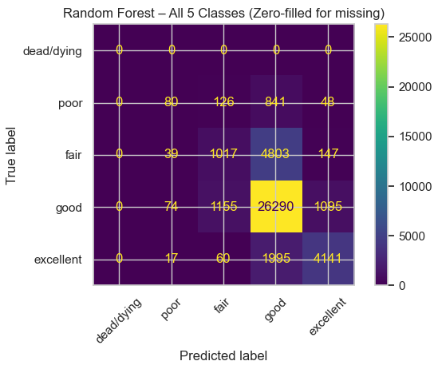

# Predicting and Analyzing Tree Health in Urban Cities

**Author:** Justin D. Schroder
**Affiliation:** Northwest Missouri State University, Maryville MO 64468, USA
**Contact:** S576004@nwmissouri.edu

---

## Abstract

 This project analyzes urban tree health in Washington, D.C.,
using a combination of exploratory data analysis (EDA), geospatial map-
ping, and machine learning classification. The dataset used comes from
the 5M Trees Dataset [3] and contains 190,992 trees with physical, ge-
ographic, and other features. Key features were cleaned, encoded, and
engineered to support predictive modeling. Information from the EDA
revealed that the majority of trees within the dataset were healthy. The
Random Forest Classifier was trained to predict five possible health con-
ditions (dead/dying, poor, fair, good, and excellent), using a 70/30 train-
test split and six input features. Results from the baseline model achieved
75.2% accuracy and a macro F1 score of 0.479. The model performed
well on healthy classes but poorly on the minority, unhealthy classes.
A SMOTE resampling experiment was conducted afterward to test the
effect of the class imbalance. SMOTE increased recall for all conditions
except good. However, the overall accuracy was lowered to 66.1%. Both
models show that tree condition is highly predictive for healthy trees
but much harder to detect for unhealthy trees with the attributes in
the dataset. This work demonstrates how machine learning can support
urban forestry efforts and highlights the need for additional ecological
features (e.g., soil data, species type, maintenance history) for urban
trees in future models.

**Keywords:**  machine learning · urban forestry · environmental data anal-
ysis · tree health classification · geospatial analytics

---

## Table of Contents

- [Predicting and Analyzing Tree Health in Urban Cities](#predicting-and-analyzing-tree-health-in-urban-cities)
  - [Abstract](#abstract)
  - [Table of Contents](#table-of-contents)
  - [Introduction](#introduction)
    - [Project Links](#project-links)
  - [Dataset](#dataset)
    - [Data Extraction and Loading](#data-extraction-and-loading)
    - [Data Dictionary](#data-dictionary)
  - [Methodology](#methodology)
    - [Data Preparation and Feature Engineering](#data-preparation-and-feature-engineering)
  - [Exploratory Data Analysis (EDA)](#exploratory-data-analysis-eda)
  - [Geospatial Analysis](#geospatial-analysis)
  - [Random Forest Classifier](#random-forest-classifier)
  - [Results and Analysis](#results-and-analysis)
    - [EDA Results](#eda-results)
    - [Geospatial Results](#geospatial-results)
    - [Random Forest Results](#random-forest-results)
    - [SMOTE Resampling Results](#smote-resampling-results)
  - [Getting Started](#getting-started)
    - [Environment Setup (uv)](#environment-setup-uv)
  - [References](#references)

---

## Introduction

Trees are essential for natural environments in both rural and urban locations.
They cover about 31 percent of the Earth’s land area, with more than half
located in just five countries, one of which is the United States of America
[2]. They have numerous benefits to ecological systems and natural processes:
regulating climate, maintaining the water cycle, replenishing nutrients back into
the soil, and supporting the biodiversity of many ecosystems [4].
In urban areas, trees are one of the main natural features. The benefits of
trees can be observed in numerous ecological systems, but their responsibilities
are no less important in cities. They reduce energy usage, remove air pollutants,
filter stormwater, and cool hot city streets by providing shade and releasing water
2 J. Schroder
vapor [5]. Exposure to urban trees and green spaces has been linked to reducing
stress, improving mood, and enhancing overall mental health in city residents
[6]. Maintaining and monitoring urban tree health is vital to the environment
and the well-being of individuals within cities.
Fig. 1. Benefits of Urban Trees [1]
Through data analytics and machine learning, this process has become signif-
icantly easier. This work analyzes the health of urban trees in Washington, D.C.
using an Exploratory Data Analysis (EDA) to understand feature distribution,
a geospatial analysis to visualize tree locations and health patterns on a map,
and a Random Forest Classifier to predict tree condition based on the relevant
features.

---

### Project Links

- **Overleaf (public):** https://www.overleaf.com/project/68f7bc1aee158ade112c1ce8
- **GitHub (public):** https://github.com/SchroderJ-pixel/Urban-Tree-Health-
- **Dataset:** https://www.kaggle.com/datasets/mexwell/5m-trees-dataset
- **FAO – The State of the World’s Forests:** https://www.fao.org/state-of-forests
- **NASA LP DAAC User Guide (2013):** https://lpdaac.usgs.gov/documents/1371/GFCC_User_Guide_V1.pdf
- **Speak for the Trees, Boston – Benefits of Urban Trees:** https://treeboston.org/tree-equity-maps/benefits-of-urban-trees/
- **The Nature Conservancy – Benefits of Urban Trees (Infographic):**
  https://www.nature.org/en-us/what-we-do/our-priorities/build-healthy-cities/cities-stories/benefits-of-trees-forests/
- **Twohig-Bennett & Jones (2018) – Greenspace Exposure and Health Outcomes:** https://doi.org/10.1016/j.envres.2018.06.030

---

## Dataset

The **5M Trees Dataset** (McCoy et al., 2022) compiles street and park tree inventories from **63 U.S. cities**. It contains **5M+ records** and **~28 attributes** per tree (identity, geography, physical characteristics, and lifecycle).
This study focuses on the **Washington, D.C.** subset (**190,992 trees**, 2017–2020 observations).

### Data Extraction and Loading

- Original format: **Excel (`.xlsx`)** → converted to **CSV (`.csv`)** for processing.
- Imported with **Polars** (speed/efficiency) and **Pandas** (organization).
- Custom read parameters standardized `"NA"`, `"N/A"`, blank cells → true missing values.
- Stored locally under `data/` and loaded in the project notebook/script.

### Data Dictionary

| Attribute                       | Description                                                                                                  | Data Type          |
|---------------------------------|--------------------------------------------------------------------------------------------------------------|--------------------|
| `condition`                     | Health rating at most recent observation: dead/dying, poor, fair, good, excellent.                          | Categorical        |
| `diameter_breast_height_CM`    | Trunk diameter at breast height (cm); proxy for size/maturity.                                              | Numeric            |
| `native`                        | Whether the species is naturally occurring (native) or introduced.                                           | Categorical        |
| `longitude_coordinate`          | East–west position in Washington, D.C.                                                                       | Numeric            |
| `latitude_coordinate`           | North–south position in Washington, D.C.                                                                     | Numeric            |
| `ward`                          | Administrative ward containing the tree.                                                                     | Numeric            |
| `planted_date`                  | Original planting date; used to derive `tree_age`.                                                           | DateTime           |

---

## Methodology

### Data Preparation and Feature Engineering

- Libraries: **Polars**, **Pandas**, **GeoPandas**, **scikit-learn**, **Matplotlib**
- Dropped rows missing **critical** fields to maintain accuracy.
- Converted string categories to numeric encodings for modeling.
- Derived **`tree_age`** from `planted_date` (current year − planted year).

| Feature             | Transformation / Description                                              | Data Type            |
|---------------------|---------------------------------------------------------------------------|----------------------|
| `native`            | Lowercased, trimmed; encoded **1 = naturally occurring**, **0 = introduced**. | Numeric (Binary)     |
| `overhead_utility`  | Standardized to y/yes/true = **1**, n/no/false = **0**.                   | Numeric (Binary)     |
| `condition_map`     | Ordinal mapping of condition for model input (0–4).                       | Numeric (Ordinal)    |
| `tree_age`          | Derived from `planted_date`.                                              | Numeric (Continuous) |

---

## Exploratory Data Analysis (EDA)

- Summary statistics: mean, median, min, max, std for numeric features.
- Correlation heatmap to assess relationships with `condition_map`.
- Distribution plots to examine class balance.

---

## Geospatial Analysis

- Converted lon/lat to GeoDataFrame (EPSG:4326).
- Plotted tree locations across D.C. color-coded by condition.

---

## Random Forest Classifier

- **Target:** `condition` (5 classes: dead/dying → excellent)
- **Features:** `longitude_coordinate`, `latitude_coordinate`, `diameter_breast_height_CM`, `native`, `overhead_utility`, `tree_age`
- **Split:** 70% train / 30% test
- **Evaluation:** accuracy, macro F1, confusion matrix, feature importance.

---

## Results and Analysis

### EDA Results

**Summary Statistics**


**Condition Distribution**


**Correlation Heatmap**


- `tree_age` ↔ `diameter_breast_height_CM`: r = 0.57
- `longitude` ↔ `latitude`: r = −0.51
- `condition` most negatively correlated with `tree_age` (−0.32) and `diameter` (−0.29)

### Geospatial Results


_Health conditions mapped across Washington, D.C.; widespread distribution across wards with varying condition levels._

---
### Random Forest Results

**Model Performance**

Accuracy: 0.752
Macro F1 (present classes only): 0.479

**Classification Report**

          precision    recall  f1-score   support

    poor      0.381     0.073     0.123      1095
    fair      0.431     0.169     0.243      6006
    good      0.775     0.919     0.841     28614

excellent 0.762 0.667 0.711 6213

accuracy                          0.752     41928


**Confusion Matrix**


**Key Insights**
- Strong predictive performance for **good** and **excellent** conditions due to large sample sizes.
- Lower recall for **poor** and **fair**, reflecting class imbalance and fewer training examples.
- Macro F1 score highlights weaker performance on minority classes since all classes are weighted equally.
- *Dead/dying* appears as zero because no samples remained in the cleaned dataset.

---
### SMOTE Resampling Results

**Model Performance**

Accuracy: 0.661
Macro F1 (present classes only): 0.481

**Classification Report (After SMOTE)**

              precision    recall  f1-score   support
poor            0.115     0.150     0.130     1095
fair            0.297     0.390     0.338     6006
good            0.809     0.718     0.761    28614
excellent       0.647     0.751     0.695     6213

accuracy                             0.661    41928
macro avg       0.467     0.502     0.481    41928
weighted avg    0.693     0.661     0.674    41928

**Confusion Matrix (After SMOTE)**


**Key Insights**

- Recall improved for **poor** (0.073 → 0.150) and **fair** (0.169 → 0.390)
- Overall accuracy decreased (0.752 → 0.661) due to more balanced predictions
- **Good** dropped in recall since it was no longer overrepresented during training
- Macro F1 slightly increased (0.479 → 0.481), showing better class balance
- Confirms that **class imbalance limited the original model**, especially for unhealthy trees

---

**Quick Comparison**

| Model       | Accuracy | Macro F1 | Poor Recall | Fair Recall |
|-------------|----------|----------|-------------|-------------|
| Baseline RF | 0.752    | 0.479    | 0.073       | 0.169       |
| SMOTE RF    | 0.661    | 0.481    | 0.150       | 0.390       |


---
## Getting Started

### Environment Setup (uv)

This project uses [`uv`](https://docs.astral.sh/uv/) for fast, reproducible Python environments.

```bash
# Create virtual environment
uv venv

# Activate (Windows)
.venv\Scripts\activate

# Or on macOS/Linux
source .venv/bin/activate

# Install dependencies defined in pyproject.toml
uv pip install -r pyproject.toml

```
---

## References
1. Conservancy, T.N.: Benefits of urban trees. https://www.nature.org/
en-us/what-we-do/our-priorities/build-healthy-cities/cities-stories/
benefits-of-trees-forests/ (nd), accessed: 2025-10-25
2. Food, of the United Nations, A.O.: The state of the world’s forests 2020 – forests
and biodiversity. https://www.fao.org/state-of-forests (2020), accessed: 2025-
10-25
3. McCoy, D.E., Goulet-Scott, B., Meng, W., Atahan, B.F., Kiros, H., Nishino,
M., Kartesz, J.: 5m trees dataset. https://www.kaggle.com/datasets/mexwell/
5m-trees-dataset (2022), accessed: 2025-10-25
4. Sexton, J.O., Feng, M., Channan, S., Song, X.P., Kim, D.H., Noojipady, P., Song,
D., Huang, C., Annand, A., Collins, K., Vermote, E.F., Wolfe, R., Masek, J., Town-
shend, J.R.G.: Earth science data records of global forest cover and change: User
guide (version 1). Tech. rep., NASA Land Processes Distributed Active Archive
Center (LP DAAC) (2013), accessed: 2025-10-25
5. Speak for the Trees, Boston: Benefits of urban trees. https://treeboston.org/
tree-equity-maps/benefits-of-urban-trees/ (nd), accessed: 2025-10-25
6. Twohig-Bennett, C., Jones, A.: The health benefits of the great outdoors: A system-
atic review and meta-analysis of greenspace exposure and health outcomes. Environ-
mental Research 166, 628–637 (2018). https://doi.org/10.1016/j.envres.2018.06.030

